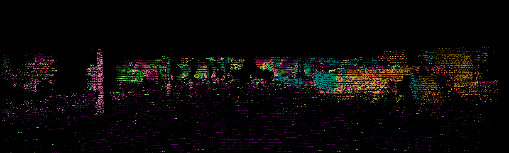
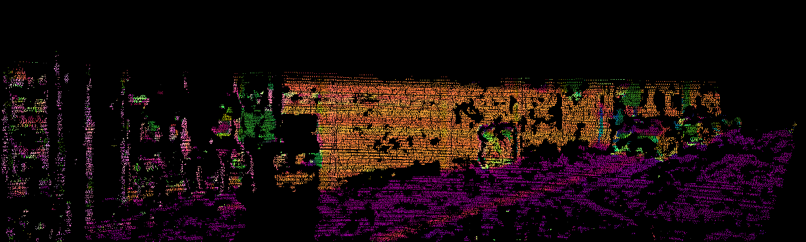

# depth2normal

A ready-to-run version of depth2normal function from [DeepLiDAR](https://github.com/JiaxiongQ/DeepLiDAR).
It uses docker for opencv2 environment.

Kitti Depth dataset should be prepared following [NLSPN](https://github.com/zzangjinsun/NLSPN_ECCV20).

### Steps
* build the opencv2.4.9 docker image with the provided dockerfile.
* **modify docker mount location** && start docker container by `bash start.sh`.
* compile depth2normal (recommend the paralleled version) by `bash compile_parallel.sh`
* **modify input/output path, split, key, OMP_NUM_THREADS** && run it by `bash run_parallel.sh`

### Results

### Other references
* [c++ json](https://github.com/nlohmann/json)
